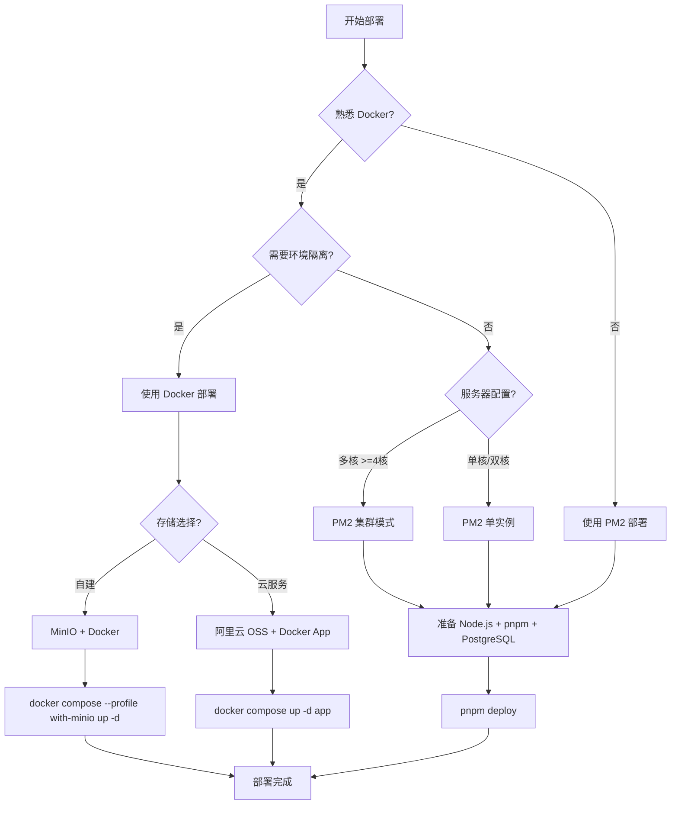

# AI Wedding 部署指南

本文档介绍两种生产环境部署方式：**Docker 部署** 和 **PM2 部署**。

---

## 选择部署方式

### 快速决策表

| 你的情况 | 推荐方式 | 原因 |
|---------|---------|------|
| 刚接触项目，想快速体验 | **Docker** | 一条命令启动所有服务，无需配置 |
| 熟悉 Node.js，有运维经验 | **PM2** | 传统部署流程，完全控制 |
| 需要在多台服务器部署 | **Docker** | 环境一致性，减少配置差异 |
| 已有 PostgreSQL 和对象存储 | **PM2** | 直接连接现有服务，无需容器化 |
| 团队协作，多人部署 | **Docker** | 避免"在我机器上能跑"问题 |
| 单服务器，追求性能 | **PM2** | 无容器开销，资源利用率更高 |

### 决策流程图



### 技术对比

| 维度 | Docker 部署 | PM2 部署 |
|------|------------|---------|
| **部署复杂度** | 中等（需安装 Docker） | 简单（传统流程） |
| **环境一致性** | 强（容器隔离） | 弱（依赖主机环境） |
| **资源开销** | 有虚拟化开销 | 无额外开销 |
| **多实例支持** | 需外部负载均衡 | 内置 cluster 模式 |
| **监控调试** | docker logs | PM2 monit 直观 |
| **跨平台** | Windows / macOS / Linux 均支持 | 主要 Linux + macOS |

---

## 目录

- [前置要求](#前置要求)
- [方式一：Docker 一键部署（推荐）](#方式一docker-一键部署推荐)
  - [macOS / Linux](#macos--linux)
  - [Windows](#windows)
  - [手动部署（不使用脚本）](#手动部署不使用脚本)
  - [部署脚本命令一览](#部署脚本命令一览)
  - [Docker 构建说明](#docker-构建说明)
- [方式二：PM2 部署](#方式二pm2-部署)
- [环境变量说明](#环境变量说明)
- [数据库迁移与初始化](#数据库迁移与初始化)
- [Nginx 反向代理](#nginx-反向代理)
- [SSL 证书配置](#ssl-证书配置)
- [监控与日志](#监控与日志)
- [常见问题](#常见问题)
- [故障排查速查表](#故障排查速查表)

---

## 前置要求

| 依赖 | Docker 部署 | PM2 部署 |
|------|:-----------:|:--------:|
| Docker Desktop / Docker Engine | 必需 | - |
| Node.js 18+ | - | 必需 |
| pnpm | - | 必需 |
| PM2 | - | 必需 |
| PostgreSQL 14+ | Docker 内置 | 需自行安装 |
| Nginx（可选） | 推荐 | 推荐 |

**服务器最低配置**：2 核 CPU / 4GB 内存 / 40GB 磁盘

### Docker 安装

| 平台 | 安装方式 |
|------|---------|
| **Windows** | 安装 [Docker Desktop for Windows](https://docs.docker.com/desktop/install/windows-install/)（需启用 WSL2） |
| **macOS** | 安装 [Docker Desktop for Mac](https://docs.docker.com/desktop/install/mac-install/) |
| **Linux** | 安装 [Docker Engine](https://docs.docker.com/engine/install/) + Docker Compose |

---

## 方式一：Docker 一键部署（推荐）

项目提供了一键部署脚本，支持 **macOS / Linux** 和 **Windows** 双平台。脚本会引导你完成所有配置并自动启动服务。

### macOS / Linux

```bash
bash deploy.sh
```

首次运行会引导你配置：
- AI API Key 和提供商
- 管理员邮箱和密码
- 存储方式（MinIO 自托管 / 阿里云 OSS）
- 自动生成 NEXTAUTH_SECRET

部署完成后，脚本会输出访问地址。

#### 日常管理命令

```bash
bash deploy.sh status     # 查看服务状态
bash deploy.sh logs       # 查看所有日志
bash deploy.sh logs app   # 只看应用日志
bash deploy.sh restart    # 重启服务
bash deploy.sh rebuild    # 重新构建并启动（代码更新后）
bash deploy.sh down       # 停止服务
bash deploy.sh backup     # 备份数据库
bash deploy.sh restore    # 恢复数据库
```

### Windows

> 需要先安装 [Docker Desktop for Windows](https://docs.docker.com/desktop/install/windows-install/) 并启用 WSL2。

在 **PowerShell** 中运行：

```powershell
Set-ExecutionPolicy -Scope CurrentUser -ExecutionPolicy RemoteSigned
.\deploy.ps1
```

交互流程与 macOS / Linux 版本一致。

#### 日常管理命令

```powershell
.\deploy.ps1 status     # 查看服务状态
.\deploy.ps1 logs       # 查看所有日志
.\deploy.ps1 logs app   # 只看应用日志
.\deploy.ps1 restart    # 重启服务
.\deploy.ps1 rebuild    # 重新构建并启动
.\deploy.ps1 down       # 停止服务
.\deploy.ps1 backup     # 备份数据库
.\deploy.ps1 restore    # 恢复数据库
```

### 手动部署（不使用脚本）

如果不想用部署脚本，也可以手动操作：

```bash
# 1. 复制配置模板
cp env.docker.example .env

# 2. 编辑 .env，至少修改以下内容：
#    - IMAGE_API_KEY（你的 AI API Key）
#    - ADMIN_EMAIL / ADMIN_PASSWORD（管理员账号）
#    - NEXTAUTH_SECRET（运行 openssl rand -base64 32 生成）

# 3. 启动（含 MinIO）
docker compose --profile with-minio up -d --build

# 4. 启动（不含 MinIO，使用阿里云 OSS）
docker compose up -d --build
```

### 部署脚本命令一览

macOS / Linux 和 Windows 脚本功能完全一致：

| 命令 | macOS / Linux | Windows (PowerShell) | 说明 |
|------|---------------|---------------------|------|
| 首次部署 | `bash deploy.sh` | `.\deploy.ps1` | 交互式配置 + 启动 |
| 启动 | `bash deploy.sh up` | `.\deploy.ps1 up` | 启动所有服务 |
| 停止 | `bash deploy.sh down` | `.\deploy.ps1 down` | 停止所有服务 |
| 重启 | `bash deploy.sh restart` | `.\deploy.ps1 restart` | 重启所有服务 |
| 重建 | `bash deploy.sh rebuild` | `.\deploy.ps1 rebuild` | 重新构建镜像并启动 |
| 日志 | `bash deploy.sh logs` | `.\deploy.ps1 logs` | 查看实时日志 |
| 应用日志 | `bash deploy.sh logs app` | `.\deploy.ps1 logs app` | 只看应用日志 |
| 状态 | `bash deploy.sh status` | `.\deploy.ps1 status` | 查看服务状态 |
| 备份 | `bash deploy.sh backup` | `.\deploy.ps1 backup` | 备份数据库 |
| 恢复 | `bash deploy.sh restore` | `.\deploy.ps1 restore` | 恢复数据库 |

### 管理员账号

在 `.env` 中设置 `ADMIN_EMAIL` 和 `ADMIN_PASSWORD`，容器首次启动时会自动创建管理员账号。启动完成后使用该邮箱和密码登录，即可访问 `/admin` 管理后台。

如果忘记设置，也可以在启动后修改 `.env` 并重启容器：

```bash
# macOS / Linux
bash deploy.sh restart

# Windows
.\deploy.ps1 restart
```

### 自定义端口

在 `.env` 文件中修改以下变量：

```bash
APP_PORT=8080           # 应用端口（默认 3000）
POSTGRES_PORT=5433      # PostgreSQL 端口（默认 5433）
MINIO_API_PORT=9000     # MinIO API 端口（默认 9000）
MINIO_CONSOLE_PORT=9001 # MinIO 控制台端口（默认 9001）
```

### Docker 构建说明

Dockerfile 采用**多阶段构建**，最终镜像仅包含运行时必需文件：

| 阶段 | 作用 |
|------|------|
| `deps` | 安装 node_modules |
| `builder` | 编译 TypeScript、生成 Prisma Client、构建 Next.js |
| `runner` | 最小化生产镜像（基于 Alpine） |

镜像特点：
- 基于 `node:20-alpine`，体积小
- Next.js standalone 模式
- 以非 root 用户 `nextjs` 运行
- 自动健康检查 `/api/health`
- 容器启动时自动执行数据库迁移和种子数据初始化

### 服务架构

```
┌─────────────────────────────────────────────────┐
│                Docker Compose                    │
│                                                  │
│  ┌───────────┐  ┌───────────┐  ┌─────────────┐ │
│  │  App       │  │ PostgreSQL│  │   MinIO      │ │
│  │ :3000      │  │  :5432    │  │ :9000/:9001  │ │
│  │ (Next.js)  │──│           │  │ (可选)       │ │
│  └───────────┘  └───────────┘  └─────────────┘ │
│                                                  │
│  postgres_data (持久化)   minio_data (持久化)    │
└─────────────────────────────────────────────────┘
```

---

## 方式二：PM2 部署

### 前置安装

```bash
# 安装 Node.js 18+（推荐使用 nvm）
curl -o- https://raw.githubusercontent.com/nvm-sh/nvm/v0.39.7/install.sh | bash
nvm install 18
nvm use 18

# 安装 pnpm
corepack enable
corepack prepare pnpm@latest --activate

# 安装 PM2
pnpm add -g pm2
```

### 快速部署

```bash
# 配置环境变量
cp .env.example .env
# 编辑 .env 填入实际配置（注意 DATABASE_URL 指向你的 PostgreSQL 实例）

# 一键部署（安装依赖 + 构建 + 启动 PM2）
pnpm deploy
```

`pnpm deploy` 会自动执行：
1. 安装依赖 (`pnpm install`)
2. 构建项目 (`pnpm build`)
3. 停止旧进程
4. 启动新的 PM2 进程
5. 保存 PM2 配置

### 手动分步部署

```bash
# 1. 安装依赖
pnpm install

# 2. 生成 Prisma Client
pnpm prisma generate

# 3. 构建项目
pnpm build

# 4. 数据库迁移
pnpm prisma migrate deploy

# 5. 初始化种子数据（首次部署）
pnpm prisma db seed

# 6. 启动 PM2
pnpm pm2:start
```

### PM2 命令速查

```bash
pnpm pm2:start      # 启动应用
pnpm pm2:stop       # 停止应用
pnpm pm2:restart    # 重启应用
pnpm pm2:logs       # 查看日志
pnpm pm2:status     # 查看状态
```

### PM2 高级配置

```bash
# 自定义端口
PORT=8081 pnpm pm2:start

# 多实例模式（适合多核服务器）
PM2_INSTANCES=4 pnpm pm2:start

# 自定义内存限制
PM2_MAX_MEMORY=2G pnpm pm2:start
```

### PM2 开机自启

```bash
# 生成开机启动脚本
pm2 startup

# 按提示执行输出的命令（需要 sudo）
# 例如：sudo env PATH=$PATH:/usr/bin pm2 startup systemd -u deploy --hp /home/deploy

# 保存当前进程列表
pm2 save
```

### 代码更新与重新部署

```bash
# 拉取最新代码
git pull origin main

# 重新部署
pnpm deploy
```

---

## 环境变量说明

Docker 部署使用 `env.docker.example` 作为模板，PM2 部署使用 `.env.example`。

### 必填变量

| 变量 | 说明 | 示例 |
|------|------|------|
| `IMAGE_API_KEY` | AI 图片生成 API Key | `sk-xxx` |
| `IMAGE_API_BASE_URL` | API 提供商地址 | `https://api.openai.com` |
| `IMAGE_API_MODE` | 生成模式 | `images` 或 `chat` |
| `NEXTAUTH_URL` | 应用访问地址 | `https://your-domain.com` |
| `NEXTAUTH_SECRET` | 会话加密密钥 | `openssl rand -base64 32` |
| `ADMIN_EMAIL` | 管理员邮箱 | `admin@example.com` |
| `ADMIN_PASSWORD` | 管理员密码 | 至少 6 位 |

### 可选变量

| 变量 | 说明 | 默认值 |
|------|------|--------|
| `STORAGE_PROVIDER` | 存储提供商 | `minio` |
| `MINIO_ENDPOINT` | MinIO 外部访问地址 | `http://localhost:9000` |
| `MINIO_ACCESS_KEY` | MinIO 访问密钥 | `minioadmin` |
| `MINIO_SECRET_KEY` | MinIO 密钥 | `minioadmin` |
| `MINIO_BUCKET_NAME` | MinIO Bucket 名称 | `ai-images` |
| `APP_PORT` | 应用端口 | `3000` |
| `POSTGRES_PORT` | PostgreSQL 外部端口 | `5433` |
| `PAYMENT_PROVIDER` | 支付提供商 | `mock` |
| `ENABLE_SSR_GUARD` | 启用 SSR 鉴权 | `true` |
| `SKIP_MIGRATIONS` | 跳过自动迁移 | `false` |
| `SKIP_SEED` | 跳过种子数据 | `false` |
| `TZ` | 时区 | `Asia/Shanghai` |

---

## 数据库迁移与初始化

### Docker 环境

Docker 容器启动时**自动执行**数据库迁移和种子数据初始化，无需手动操作。

如需手动执行：

```bash
# 执行迁移
docker compose exec app npx prisma db push

# 初始化数据
docker compose exec app npx prisma db seed

# 打开 Prisma Studio（调试用）
docker compose exec app npx prisma studio
```

### PM2 / 裸机环境

```bash
# 执行迁移
pnpm prisma migrate deploy

# 初始化数据
pnpm prisma db seed

# 打开 Prisma Studio
pnpm prisma studio
```

---

## Nginx 反向代理

### 安装 Nginx

```bash
# Ubuntu/Debian
sudo apt update && sudo apt install -y nginx

# CentOS/RHEL
sudo yum install -y nginx
```

### 配置文件

创建 `/etc/nginx/sites-available/ai-wedding`：

```nginx
upstream ai_wedding {
    server 127.0.0.1:3000;
    keepalive 64;
}

server {
    listen 80;
    server_name your-domain.com;

    # 重定向到 HTTPS（配置 SSL 后启用）
    # return 301 https://$host$request_uri;

    client_max_body_size 20M;

    location / {
        proxy_pass http://ai_wedding;
        proxy_http_version 1.1;
        proxy_set_header Upgrade $http_upgrade;
        proxy_set_header Connection 'upgrade';
        proxy_set_header Host $host;
        proxy_set_header X-Real-IP $remote_addr;
        proxy_set_header X-Forwarded-For $proxy_add_x_forwarded_for;
        proxy_set_header X-Forwarded-Proto $scheme;
        proxy_cache_bypass $http_upgrade;
        proxy_read_timeout 120s;
        proxy_send_timeout 120s;
    }

    # SSE 流式响应（图片生成）
    location /api/generate-stream {
        proxy_pass http://ai_wedding;
        proxy_http_version 1.1;
        proxy_set_header Connection '';
        proxy_set_header Host $host;
        proxy_set_header X-Real-IP $remote_addr;
        proxy_set_header X-Forwarded-For $proxy_add_x_forwarded_for;
        proxy_set_header X-Forwarded-Proto $scheme;
        proxy_buffering off;
        proxy_cache off;
        proxy_read_timeout 300s;
    }

    # 静态资源缓存
    location /_next/static/ {
        proxy_pass http://ai_wedding;
        expires 365d;
        add_header Cache-Control "public, immutable";
    }
}
```

### 启用站点

```bash
sudo ln -s /etc/nginx/sites-available/ai-wedding /etc/nginx/sites-enabled/
sudo nginx -t
sudo systemctl reload nginx
```

---

## SSL 证书配置

### 使用 Let's Encrypt（推荐）

```bash
# 安装 certbot
sudo apt install -y certbot python3-certbot-nginx

# 申请证书（自动配置 Nginx）
sudo certbot --nginx -d your-domain.com

# 自动续期测试
sudo certbot renew --dry-run
```

---

## 监控与日志

### Docker 环境

```bash
# 实时日志
docker compose logs -f

# 应用健康检查
curl http://localhost:3000/api/health

# 容器资源使用
docker stats ai-wedding-app ai-wedding-db
```

### PM2 环境

```bash
# 实时日志
pm2 logs ai-wedding

# 进程监控面板
pm2 monit

# 查看详细状态
pm2 show ai-wedding

# 日志轮转
pm2 install pm2-logrotate
pm2 set pm2-logrotate:max_size 50M
pm2 set pm2-logrotate:retain 30
pm2 set pm2-logrotate:compress true
```

---

## 常见问题

### 1. Docker 构建失败

| 症状 | 解决方案 |
|------|---------|
| `pnpm install` 超时 | 检查网络；可修改 `.npmrc` 使用国内镜像 |
| `prisma generate` 报错 | 确保 `prisma/schema.prisma` 和 `prisma.config.ts` 正确 |
| 磁盘空间不足 | 运行 `docker system prune -a` 清理旧镜像 |

### 2. 数据库连接失败

**Docker 环境**：`DATABASE_URL` 由 `docker-compose.yml` 自动设置，无需手动配置。确保 PostgreSQL 容器健康：

```bash
docker compose ps     # 检查容器状态
docker compose logs postgres  # 查看数据库日志
```

**PM2 环境**：确保 `.env` 中 `DATABASE_URL` 正确指向你的 PostgreSQL 实例。

### 3. 端口被占用

```bash
# 查看端口占用（macOS / Linux）
lsof -i :3000

# 查看端口占用（Windows PowerShell）
Get-NetTCPConnection -LocalPort 3000

# 修改端口：编辑 .env 中的 APP_PORT
```

### 4. MinIO 403 错误

```bash
# Docker 环境
docker compose exec app pnpm fix-minio
docker compose exec app pnpm fix-minio:policy

# PM2 环境
pnpm fix-minio
pnpm fix-minio:policy
```

### 5. Windows 特殊问题

| 症状 | 解决方案 |
|------|---------|
| PowerShell 禁止运行脚本 | 运行 `Set-ExecutionPolicy -Scope CurrentUser -ExecutionPolicy RemoteSigned` |
| Docker Desktop 未启动 | 从开始菜单启动 Docker Desktop，等待其完全就绪 |
| WSL2 未安装 | 以管理员运行 `wsl --install`，重启后再安装 Docker Desktop |
| 构建时 line ending 错误 | 确保 `git config core.autocrlf input`，然后重新 clone |

### 6. macOS 特殊问题

| 症状 | 解决方案 |
|------|---------|
| Docker Desktop 需要权限 | 系统偏好设置 -> 安全性与隐私 -> 允许 Docker |
| Apple Silicon (M1/M2/M3) 兼容性 | 项目已适配 ARM64，正常使用即可 |
| `sed` 命令行为不同 | 部署脚本已处理 macOS/Linux `sed` 差异，无需担心 |

### 7. SSE 流式响应超时

确保 Nginx 配置中 `/api/generate-stream` 的 `proxy_buffering` 设为 `off`，`proxy_read_timeout` 足够长（建议 300s）。

### 8. 静态资源 404

Docker standalone 模式下需确保 `.next/static` 正确复制，检查 Dockerfile 中的 COPY 指令是否完整。

---

## 故障排查速查表

### 首次部署问题

| 问题症状 | Docker 解决方案 | PM2 解决方案 |
|---------|----------------|-------------|
| 启动失败：表不存在 | 已自动处理（entrypoint 执行迁移） | 手动执行 `pnpm prisma migrate deploy` |
| 健康检查失败 | 查看日志：`docker compose logs app` | 查看日志：`pm2 logs ai-wedding` |
| 数据库连接拒绝 | 检查 PostgreSQL 容器是否 healthy | 检查 PostgreSQL 是否运行 |
| MinIO 启动失败 | 确保使用 `--profile with-minio` 启动 | 配置阿里云 OSS 或独立部署 MinIO |
| 种子数据导入失败 | 非致命，可手动：`docker compose exec app npx prisma db seed` | `pnpm prisma db seed` |

### 运行时问题

| 问题症状 | Docker 解决方案 | PM2 解决方案 |
|---------|----------------|-------------|
| 端口被占用 | 修改 `.env` 中 `APP_PORT` | `PORT=8080 pnpm pm2:start` |
| 内存溢出（OOM） | 在 `docker-compose.yml` 添加 `memory: 2G` 限制 | `PM2_MAX_MEMORY=2G pnpm pm2:start` |
| 图片上传 403 | `docker compose exec app pnpm fix-minio` | `pnpm fix-minio` |
| SSE 流式超时 | 检查 Nginx `proxy_read_timeout` 配置 | 同左 |
| CPU 持续高负载 | `docker stats ai-wedding-app` | `pm2 monit` |
| 磁盘空间不足 | `docker system prune -a` | `pm2 flush` |

### 数据库问题

| 问题症状 | Docker 排查 | PM2 排查 |
|---------|------------|---------|
| 连接超时 | `docker compose exec postgres pg_isready` | `psql -h localhost -U user -d ai_wedding -c "SELECT 1"` |
| 迁移失败 | `docker compose exec app npx prisma migrate status` | `pnpm prisma migrate status` |
| 数据丢失 | 检查卷：`docker volume ls` | 检查 PostgreSQL 数据目录权限 |

### 日志收集命令

```bash
# Docker 环境
docker compose logs --tail=200 > deployment-logs.txt

# PM2 环境
pm2 logs ai-wedding --lines 200 --nostream > deployment-logs.txt

# 系统级诊断
docker --version && docker compose version
```

---